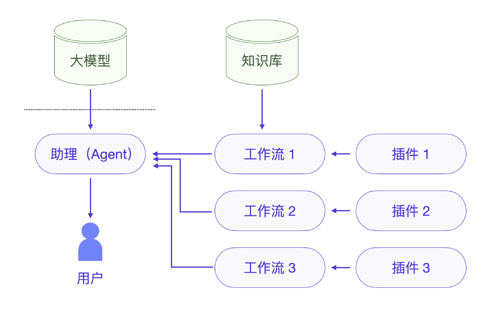
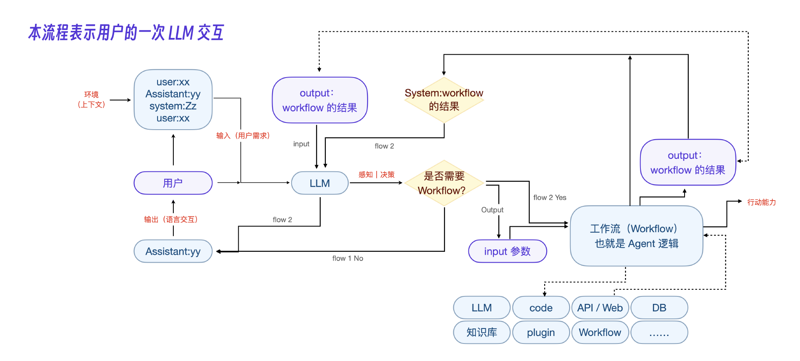

# 什么是Agent
市场上有一些低代码的 Agent 开发平台，比如斑头雁、扣子等等。我们基于这些平台就可以开发自己的 Agent 智能体应用，也可以直接把这些应用分享给用户。

Agent 平台里的助理不是只有聊天能力，它还能做很多事。比如客服助理自带有客服能力，用户跟这个助理聊天的时候就是在跟一个客服聊天。你还可以自建和扩展助理的能力，比如这个客服助理的退款功能就是自定义的，它可以自动识别订单号，发起退款流程。

退款功能先要要用到私有数据库。那很多公有的能力比如搜索数据等如何实现呢？这就要靠 Agent 平台的另外一个核心概念，插件能力。

比如搜索能力可以用 Google Web Search 插件，上面提到的退款流程则需要用到 Database 插件。

Agent 智能体开发效率高，就是因为这些平台提供了大量插件能力和多种大模型提供的接入能力。

助理可以看做 Agent 应用的界面，比如例子里的客服助理。但你其实就是在和大模型在聊天，只不过在你和大模型之间还有一个代理程序，它就是 Agent。我们可以把 Agent 看做大模型的代理人。

在 Agent 平台里还有一个重要概念就是工作流。助理负责识别具体的业务逻辑并调取工作流，一个工作流其实就是一个原有业务逻辑。比如客服里的退货业务，实际上工作流是被动配合助理的。
几个概念综合起来，内部的实现就很容易理解了，由外到内一共四层关系：助理 -> 工作流 -> 插件 -> 知识库。

可以这样理解，工作流就是传统应用里的独立功能的函数或程序，那插件呢，就是传统程序里的系统库函数，知识库就是传统数据库。

Agent 底层的架构流程图:

## Agent 代理层的核心
Agent 代理层的核心有两点
- 一是基于上下文的用户意图识别
- 二是调用自定义的工作流完成业务逻辑。

意图识别和参数识别的具体实现方法有两种，可以通过微调大模型实现，也可以通过提示词实现，思想都是想通的。

微调的优势:
- 更好的整合性: 微调后的模型可以更自然地将插件能力融入到自身的知识和推理过程中,而不是单纯依赖提示词触发。
- 性能提升: 经过微调,模型可以更准确地判断何时使用插件,减少不必要的调用,提高效率。
- 上下文理解: 微调模型可以基于更广泛的上下文来决定是否使用插件,而不仅仅依赖特定的触发词。
- 灵活性: 可以根据具体应用场景定制模型的插件使用行为。

微调的劣势:
- 成本高: 微调过程需要大量的计算资源和时间,相比简单的提示词方案成本更高。
- 复杂性: 需要设计合适的微调数据集和训练策略,这个过程比编写提示词更为复杂。
- 可能的过拟合: 如果微调不当,模型可能过度依赖特定插件或在不恰当的场景使用插件。
- 更新困难: 当需要添加或修改插件时,可能需要重新进行微调,而提示词方案则更容易更新。

相比之下,提示词方案的主要优势在于实施简单、成本低、易于更新。但它可能缺乏灵活性,且在复杂场景下的表现可能不如经过微调的模型。