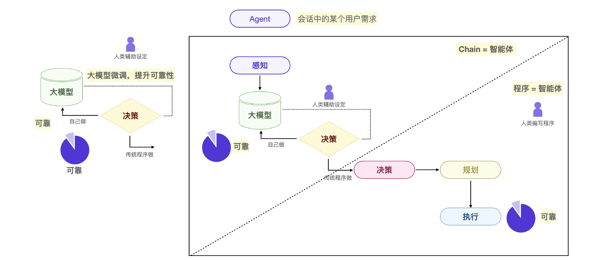

# Agent智能体四要素


大模型在智能体四要素上的可靠性决定了我们的开发范式。简言之，我们通过编程引导大模型做决策和规划，通过传统程序做执行，在特定的前提和领域下就可以开发足够可靠的 Agent 智能体。

## 案例：一个 LangChain 智能体
下面是一段伪代码，表示根据用户问题查询搜索引擎，最后总结出答案的 Agent 智能体。
```python
from langchain.chains import SimpleChain
from langchain.llms import OpenAI
from langchain.tools import GoogleSearchTool


# 初始化语言模型和工具
llm = OpenAI(api_key="your-api-key")
google_search = GoogleSearchTool(api_key="your-google-api-key")


# 定义Chain
class QuestionAnswerChain(SimpleChain):
    def __init__(self, llm, search_tool):
        self.llm = llm
        self.search_tool = search_tool


    def call(self, input_text):
        # 使用语言模型分析问题
        search_query = self.llm(input_text)
        # 使用搜索工具查找答案
        search_results = self.search_tool(search_query)
        # 通过语言模型总结答案
        answer = self.llm(search_results)
        return answer


# 使用Chain
qa_chain = QuestionAnswerChain(llm, google_search)
user_question = "法国的首都是哪里？?"
answer = qa_chain.call(user_question)
print(answer)
```
例子中的 QuestionAnswerChain 是一个自定义的 Chain，而 Chain 就是 LangChain 框架的核心概念，你可以理解为一个 Chain 就是一个自定义的具备单独能力的智能体。

- 针对用户搜索的输入，通过 self.llm(input_text) 来感知到用户搜索的关键词，这一步是大模型微完成的。
- 第二步用 GoogleSearchTool 查找信息，实际上是我们编程做的决策和规划。
- 最后利用了大模型的语言能力来做输出的执行，也就是 self.llm(search_results)。


总结来说，一个基于 Chain 的简单智能体，其感知、决策、规划、执行，每一步都有我们人类的设定和参与，就能很好的完成这个小任务。


## 案例：微调智能体决策能力
很多人认为大模型微调是给大模型增加特定的数据。真实情况是，大模型微调，是让它具备基础的某种特定能力。

比如在我们的自动编程智能体案例中，如果要让智能体掌握一门新的开发语言，就可以用大量的现成代码微调大模型。目的并不是让大模型记住这些代码，而是让大模型通过这些代码找到这门语言内在的语法和逻辑关系。当新的开发需求出现时，大模型可以根据这些内在逻辑去推理。

你可以用数据微调大模型，也可以通过智能体的提示词微调大模型。提示词的微调方法往往适用于某个场景下大模型决策不够精准的情况，用提示词可以引导大模型在特定条件下的决策。

我们编写的提示词和各个工作流的输入输出参数，实际上就是在对大模型的决策和规划做微调，我们写的提示词的好坏会直接影响大模型的决策规划表现。

如果提示词的方法无法调整大模型的决策表现，还可以用大模型微调的方法继续调整它的能力。

这两个微调方法并不冲突，都是给大模型插入新的可靠决策和规划能力。那么现在，大模型沟通是可靠的，插件能力是可靠的，微调让意图识别变的可靠，最终开发的 Agent 智能体自然是可靠的。

