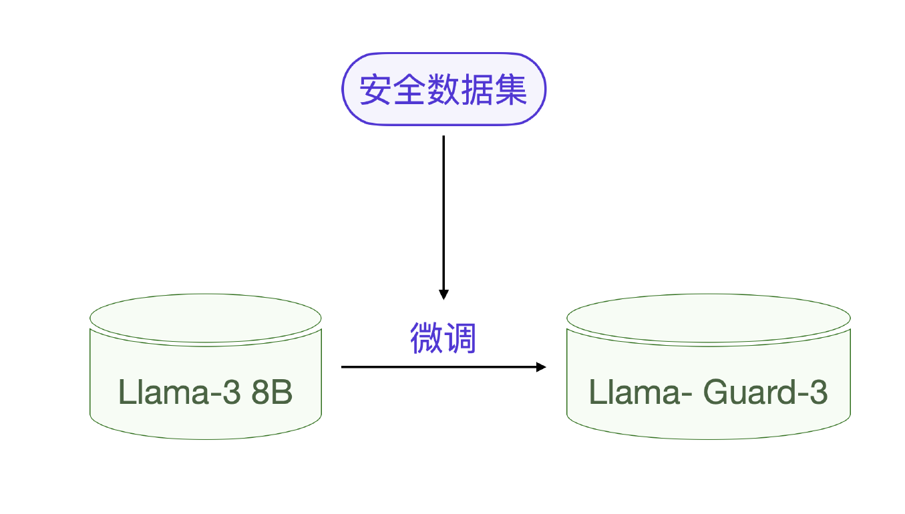

# ChatGPT 的奖励模型

先理解第一个层次，Reward Modeling 奖励模型最终实现了全自动地评估 ChatGPT 的输出并为其打分，以便和人类价值观对齐。这个自动化的 evaluate 评估 - 打分能力实际上已经等同于人类的能力。

再说第二个层次，要实现这个奖励模型，实际上还是需要人类业务专家先评估语料的质量，真实过程是用小样本的人类专家的数据标注，模型经过训练后获得全功能的输出评估能力。

这个过程就是 RLHF 阶段的 step 2 ，如下图所示，也就是奖励模型的实现过程。

在第一阶段，预训练的大语言模型首先使用人类标注的高质量数据集进行监督微调，第二阶段就是之前分析的基于人类专家数据标注的奖励模型训练，第三阶段是采用 PPO 算法让大模型在奖励模型评分的基础上保持稳定的数据质量。

从图中可见，奖励模型是怎么获得结果评估的能力呢？是人类评估专家提前对结果做 A、B、C、D 的评估和排序，最终通过单独的模型训练让奖励模型获得评估能力。我们也可以说，这个奖励模型就是一个**评估专家模型**。其作用是评估多个大模型输出的质量好坏。

相比较而言，在数据工程里对数据质量的评估，在模型测评里对某类问题的结果评估则比 RLHF 里的评估专家要简单。所以，这样的评估任务完全可以借鉴 ChatGPT 奖励模型的思路。

##  Llama Guard 3‍模型
以 Llama 模型里的一个专门用于内容安全性评估的模型: Llama Guard 3‍模型为例。

当你向大模型的提问带有某些风险的时候，大模型的输出会明确提示这个风险，甚至你让大模型输出某些不文明用语都会被阻止。这其实要归功于 Llama Guard 3‍这类防止滥用防护评价模型。

当用户向 Llama 3 提问的时候，每次 Llama 3 都会让 Llama Guard 3‍来做安全评估，其实现过程也是一次大模型调用。

可以把 Llama Guard 3‍ 看做一个典型的评估专家模型，他的作用是给输出内容做安全评估和分类。在具体实现上，Llama Guard 3‍ 其实就是一个经过微调的大模型，它是基于 Llama 3.1 8B 小模型微调训练的。

## 评估专家模型设计
评估专家模型设计的两个要点：
- 其一是评估专家的模型训练方法就是大模型微调训练;
- 其二需要为特定的评估专家准备特定的数据集。核心思想是人类整理数据集，让大模型学会人类的评估方法。

那什么场景下用什么数据集呢？3 类数据集的区别：
- KTO（Knowledge Trained Optimization） 的输出是绝对的 0-1 这样二值判断
- RLHF 则是类似 ChatGPT 输出的排序评估，比如 A > B > C > D
- DPO（Direct Preference Optimization），是对 A-B 两种结果的倾向性评估, 比如 A > B

那 KTO 训练和 DPO 训练有什么不同？
- 训练过程中，KTO 方法需要对输出结果进行二元判断，也就是输出：符合预期 / 不符合预期，所以其收集的数据为 Prompt+Chosen 或 Rejected；
- DPO 训练依赖人类反馈，需要对输出结果进行偏好性判断，输出是两个结果的倾向程度，所以其收集的数据为 Prompt+Chosen 和 Rejected。

KTO 和 DPO 的数据集都表示在一个提示词下，用户和 AI 问答数据的优选策略，chosen 表示优选，rejected 表示次优或丢弃.

### KTO 和 DPO 适用的场景。
KTO（Knowledge Trained Optimization）更适合客观问题，因为它依赖于对输出结果进行明确的二元判断（符合预期或不符合预期）。这意味着它的应用场景主要是有明确标准答案的领域，例如数学问题、技术操作或事实陈述等。在这些场景中，输出结果要么正确，要么错误，没有太多的主观性。

DPO（Direct Preference Optimization） 则更加适合主观问题，因为它依赖人类的偏好进行相对判断（两个输出的倾向性）。在这类问题中，可能不存在绝对的“正确答案”，而是更多取决于人类的判断和偏好，例如内容创作、文学作品、设计审美等。在这些场景中，输出的好坏并不取决于客观标准，而是根据用户的偏好来选择更优的输出

### 人类专家的作用
当然，数据集仍然要靠人类专家来准备和标注，和其他大模型数据集一样，人类准备的数据集实际上是对大模型起到一个引导的作用。

做评估专家模型的时候，无论如何，不要重头开始训练一个新模型，而是基于预训练模型如 Llama 3 ，ChatGLM 3 来训练，这样才能更好利用这些模型已经内化的能力。