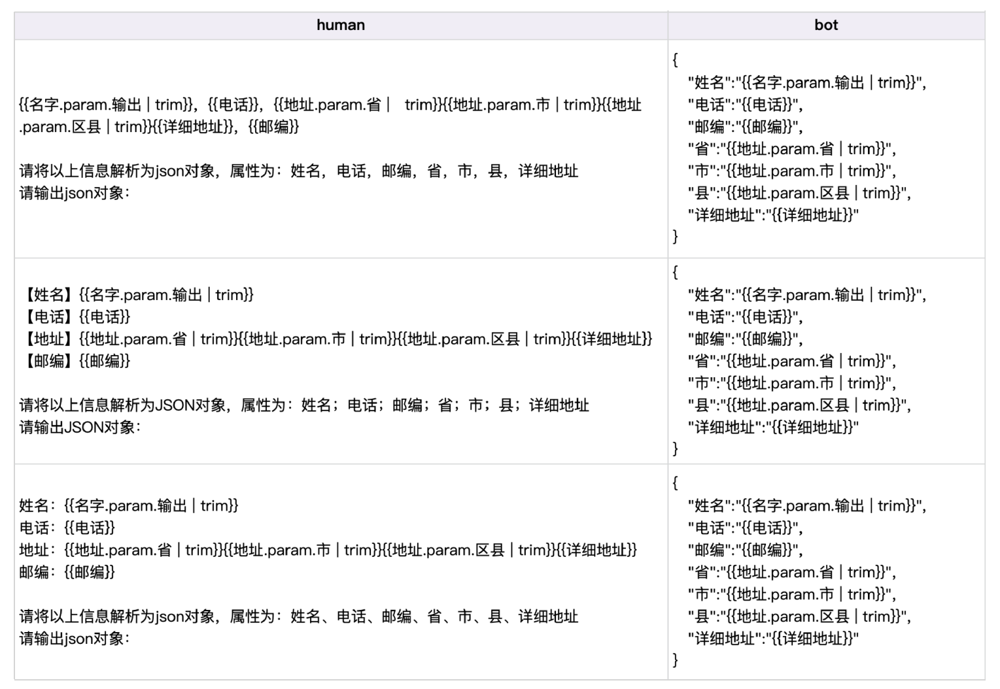
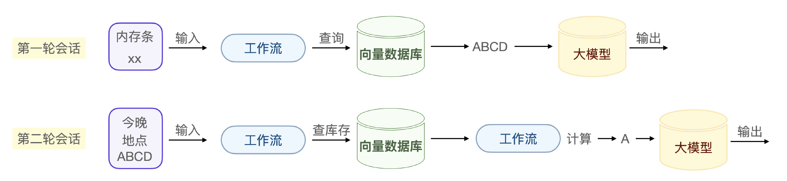

# 微调与数据
## 1. 怎么在没有数据或只有少量数据的前提下，生成足够多的客服数据用于模型训练呢？

大模型的泛化能力，其实就是人类举一反三的能力。我们做微调，目的都是让大模型在某类问题上完全具备某种能力。

以客服领域为例，客服领域的微调数据准备就是话术整理。针对某类问题，如果有正则的模板、规则库，则可以利用它们。如果没有，那就从历史对话里总结数据规则，整理出用于训练的数据。

以电商客服最常见的个人发货信息为例，大模型先从会话里抽取关键客户信息。
```
张三，13800138000，广东省深圳市南山区高新技术园区创新大厦，518057


请将以上信息解析为json对象，属性为：姓名，电话，邮编，省，市，县，详细地址
请输出json对象：
```
经过大模型抽取后的json数据如下：
```json
{
  "姓名": "张三",
  "电话": "13800138000",
  "邮编": "518057",
  "省": "广东省",
  "市": "深圳市",
  "县": "南山区",
  "详细地址": "高新技术园区创新大厦"
}
```
这个训练数据里有一个提示词 `请将以上信息解析为json对象，属性为：xxx`。这个提示词实际上就是在将来微调大模型时，指示它往地址信息抽取这个具体能力上学习。训练时要将抽取前和抽取后的 JSON 结对。

在大量地用这个提示词的数据训练之后，当我们明确在程序里指明这个提示词前缀时，大模型就具备了这项能力。

那解决一类问题的微调数据要准备多少，才能让大模型具备比较好的泛化能力呢？我的经验是，要让智能客服处理复杂会话且准确提取参数，每一个细化的场景需要 1000-10000 条训练数据，大量的数据才能把大模型微调到我们想要的方向上。


## 2. 如果一个问题的良好问答数据例子极少，提示词无法很好回答，怎么办? 数字孪生

数字孪生的根本目的，就是根据一个数据自动造出一类数据。比如：
```
张三，13800138000，广东省深圳市南山区高新技术园区创新大厦，518057
```
其一是句式的调整，比如把电话放在第一位:
```
13800138000，张三，广东省深圳市南山区高新技术园区创新大厦，518057
```
其二是数据的调整，比如改为李四的信息。
```
李四，13987654321，江苏省南京市玄武区中山路188号，210018
```
准备足够多的句式变种和数据变种，大模型就能在此基础上自动泛化识别剩余的句式和数据。

### Jinja2 库 & Faker 库
要实现数字孪生，可以用 Jinja2 和 Faker 这两个 Python 库分别实现句式变种和数据变种。

具体数据，都可以通过 Faker 库来生成，这样我们就把原子数据准备好了，下一步再通过 Jinja2 制作不同的模版表示这个信息的不同句式。

原数据：
```
张三，13800138000，广东省深圳市南山区高新技术园区创新大厦，518057
```
Jinja2 模版：
```
{{名字.param.输出 | trim}}，{{电话}}，
{{地址.param.省 |  trim}}{{地址.param.市 | trim}}{{地址.param.区县 | trim}}{{详细地址}}，
{{邮编}}
```
比如 {{名字.param.输出 | trim}} 这个模版元素。它表示最终制作数据时，模版这个位置用 名字 这个字段，并且用 trim 去除空格。

现在还有一个问题，如何自动生成不同的句式模版，最简单的方法是通过 GPT 提示词的方法，写出这个模版的同义句。
```
写出下面模版的同义句，保留{{}}内部的模版参数：
{{名字.param.输出 | trim}}，{{电话}}，{{地址.param.省 |   trim}}{{地址.param.市 | trim}}{{地址.param.区县 | trim}}{{详细地址}}，{{邮编}}


只输出模版即可
```
微调大模型需要同时输入 human 和 bot 的对话数据，因此还需要把 bot 的输出格式也制作成 Jinja2 模版。




利用 Faker 生成模拟数据。在下面的实现代码中，fake.phone_number() 这个系列的函数是最关键的，它们用于生成逼真的数据:
```py
import pandas as pd
from faker import Faker


# 初始化Faker
fake = Faker('zh_CN')


# 创建一个空的DataFrame
columns = ["姓名", "电话", "邮编", "省", "市", "县", "详细地址"]
df = pd.DataFrame(columns=columns)


# 生成10条数据
for _ in range(10):
    data = {
        "姓名": fake.name(),
        "电话": fake.phone_number(),
        "邮编": fake.postcode(),
        "省": fake.province(),
        "市": fake.city_name(),
        "县": fake.district(),
        "详细地址": fake.street_address()
    }
    # 将生成的数据添加到DataFrame中
    df = df.append(data, ignore_index=True)


# 将DataFrame保存为CSV文件
df.to_csv("fake_data.csv", index=False)


# 输出生成的表格
print(df)
```

现在可以在 Faker 模拟数据脚本基础上，结合特定的 Jinja2 模版批量制造训练数据了。
```py
from jinja2 import Template
from faker import Faker
import random


... ...


# 定义Jinja2模板
template_string = """
human:
{{名字.param.输出 | trim}}，{{电话}}，{{地址.param.省 | trim}}{{地址.param.市 | trim}}{{地址.param.区县 | trim}}{{详细地址}}，{{邮编}}


请将以上信息解析为json对象，属性为：姓名，电话，邮编，省，市，县，详细地址
请输出json对象：


bot:
{
   "姓名":"{{名字.param.输出 | trim}}",
   "电话":"{{电话}}",
   "邮编":"{{邮编}}",
   "省":"{{地址.param.省 | trim}}",
   "市":"{{地址.param.市 | trim}}",
   "县":"{{地址.param.区县 | trim}}",
   "详细地址":"{{详细地址}}"
}
"""


# 创建模板对象
template = Template(template_string)


# 生成训练数据
training_data = []


for _ in range(10):  # 生成10条数据
    ... ...
    
    data = {
        "名字": {"param": {"输出": fake.name()}},
        "电话": fake.phone_number(),
        "邮编": fake.postcode(),
        "地址": {
            "param": {
                "省": province,
                "市": city,
                "区县": district
            }
        },
        "详细地址": detailed_address
    }
    
    # 渲染模板
    output = template.render(data)
    training_data.append(output)


# 输出训练数据
for entry in training_data:
    print(entry)
    print("="*50)
```

## 构建复杂会话
原始数据和数据模版
```
#原始数据
{
“问：请问有没有兼容我笔记本型号的内存条？
答：有ABCD几种不同容量和品牌的内存条可供选择。
问：今天晚上能送到XX市吗？
答：A型号的内存条可以今晚送到。
”
}


#数据模版
从以下对话中提取客户需求信息和时间地点信息：
{
“问：请问有没有兼容我{{设备}}型号的{{配件}}？
答：有{A}{B}{C}{D}种。
问：{{时间}}上能不能送到{{地点}}？
答：{A}种可以{{今晚}}送到。”
}
```
还是可以用 Faker 库制作模拟数据，用 GPT 扩写模版，最后用数字孪生技术生产训练数据。

当大模型意图识别到 根据特定送达时间获取产品需求 这个细分场景需求的时候，我们的工作流实际上是根据精确的输入参数在做匹配和计算。

