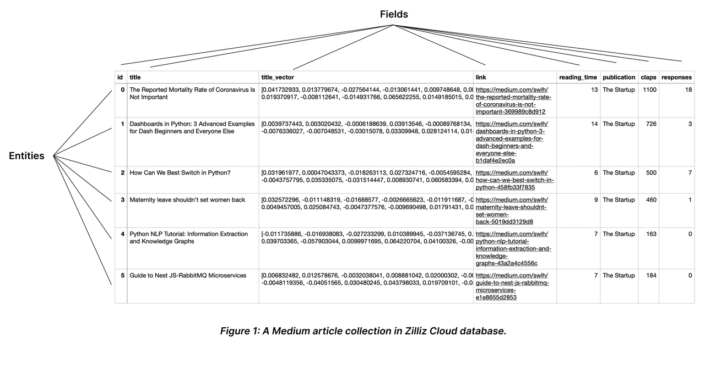

# Milvus
Milvus 是一个查询比较高效的向量数据库，开源版支持很好的私有性，适合私有化场景，还具备分布式扩展能力，将来的扩展性很好。

向量数据库本质上和传统数据库没有什么差别，也可以存储传统数据库的信息，只是为了方便将来做向量查询，需要对查询字段做向量存储。

Milvus 数据库的 Collection 就相当于传统数据库的表，因为 Milvus 数据库是非结构化的，因此可以把产品信息分成若干段结构存入Milvus。

## install
https://milvus.io/docs/zh/milvus_lite.md

Milvus Lite 仅适用于小规模向量搜索使用案例。对于大规模用例，建议使用Milvus Standalone 或 Milvus Distributed

## Database
与传统数据库引擎类似，可以在 Milvus 中创建数据库，并为某些用户分配管理这些数据库的权限。然后，这些用户就有权管理数据库中的 Collections。
```py
from pymilvus import connections, db

conn = connections.connect(host="127.0.0.1", port=19530)

database = db.create_database("my_database")
```

## Collection 和 Entity
Collections 和 Entity 类似于关系数据库中的表和记录。




## reference
https://milvus.io/docs/zh/manage_databases.md