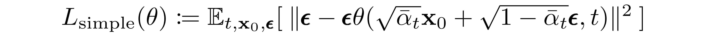
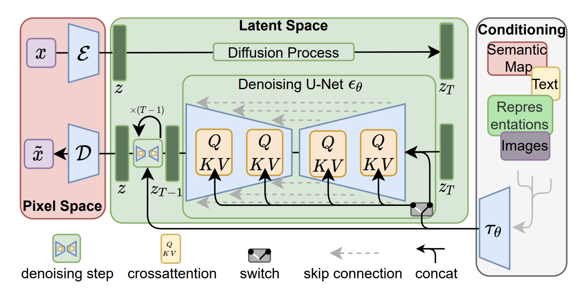
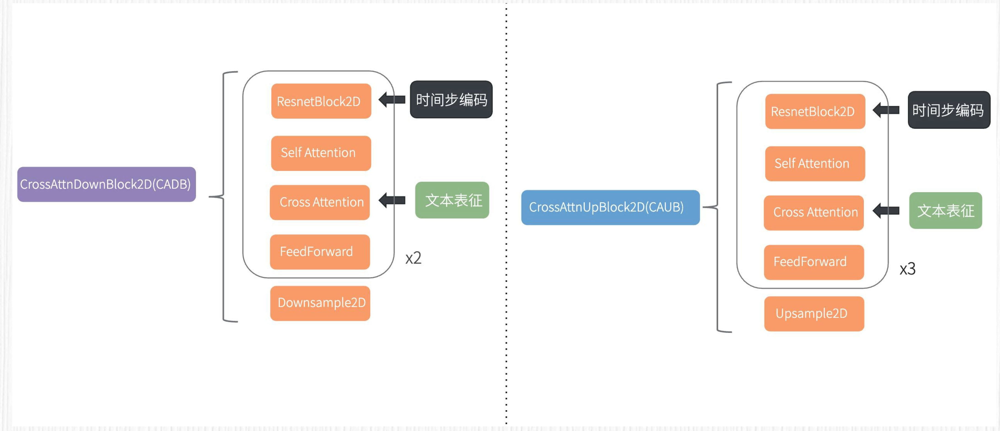

# Diffusion
DALL-E 2、Imagen、Stable Diffusion 这些大名鼎鼎的模型，它们背后的魔术师都是扩散模型。

扩散模型的灵感源自热力学。我们可以想象一下这样的过程，朝着一杯清水中滴入一滴有色碘伏，然后观察这杯水。
你会发现，碘伏在水中会有一个扩散的过程，最终完全在水中呈现出均匀的状态。扩散效应代表从有序到混乱的过程。

AI 绘画中的扩散模型和上面的例子类似，对于一张图片，逐渐加入噪声，最终图像将变成一张均匀的噪声图:


如果把这个过程反过来，从一个随机噪声图出发，逐步去除噪声，可以生成一张高质量的图片，这便达成了 AI 绘画的目的。


基于扩散模型实现 AI 绘画的精髓就在于，如何实现这个逐步去除噪声的过程。在每一步的去噪过程中，起作用的是一个需要**训练的神经网络，也就是一个 UNet**。

所以，基于扩散模型实现 AI 绘画包括两个过程——加噪过程和去噪过程。

<br>

## 加噪过程
对于 Diffusion 模型的加噪过程，每一步加噪依赖于时间步 t（t 的取值为 1-1000 中的一个整数，代表加噪声的步数）。
t 越接近 0，当前加噪结果越靠近原始图像；t 越接近 1000，当前加噪结果越靠近纯噪声。


当我们通过训练得到神经网络 UNet 后，从原始噪声图出发，时间步取 1000，UNet 便可以预测第一次要去除的噪声值。
然后，采样器便可以根据原始噪声图去除当前噪声值得到一张清晰一点儿的带噪声图像。反复重复这个过程，便完成了 AI 绘画的过程。


每一步的加噪结果仅依赖于上一步的加噪结果和一个加噪过程，而这个加噪过程依赖于当前时间步 t，因此整个加噪过程可以看成参数化的马尔科夫链。
马尔可夫链是一种数学模型，用于描述随机事件的序列，其中每个事件的概率仅取决于上一个事件的状态，而与过去的事件无关。

具体加噪去噪过程，可以参考论文：https://readpaper.com/pdf-annotate/note?pdfId=4557071478495911937&noteId=1833652073759793152

你只需要记住一个事情: **对于一张干净的图像，可以通过一次计算得到任意 t 步加噪声的结果**。

<br>

## 去噪过程
去噪的过程包括两层含义。
- 第一，如何根据当前时间步的噪声图预测上一步加入的噪声？
- 第二，如何在当前时间步的噪声图上去除这些噪声？

先看第一层含义，如何根据加噪结果和时间步 t 预测噪声呢？这里深度学习模型就能派上用场了！我们希望得到这样一个模型，输入第 t 步加噪结果和时间步 t，预测从第 t-1 步到第 t 步噪声值。

主流的方法是训练一个 UNet 模型来预测噪声图。因为噪声值和输入图的分辨率是一致的，而 UNet 模型常用于图像分割任务，输入输出的分辨率相同，使用 UNet 来完成这个任务再合适不过了。


接下来是第二层含义。假定我们能够成功预测出这个噪声图，又如何去除噪声呢？答案是采样器，你可能已经从 WebUI 中见到过各种各样的采样器，比如 DDIM、Eular A 等。采样器的作用便是根据加噪结果和噪声值，准确地去除噪声。

<br>

## 训练和推理
训练针对的是刚刚提到的 UNet 黑盒，推理环节指的是从一个高斯噪声出发得到一张干净的图片。


对于训练过程，假定我们已经收集了一个用于训练扩散模型的训练集，整个训练过程便是不断重复下面这六个步骤。
- 每次从数据集中随机抽取一张图片。
- 随机从 1 至 1000 中选择一个时间步 t。
- 随机生成一个高斯噪声。
- 根据上述加噪环节的公式，一次计算直接得到第 t 步加噪的结果图像。
- 将时间步 t 和加噪图像作为 UNet 的输入去预测一个噪声值。
- 使用第五步预测的噪声值和第三步随机生成的噪声值，计算数值误差，并回传梯度

计算数值误差的公式如下图所示，细心的你一定已经发现了，这里用到的正是 L2 损失:



当我们反复循环上面的过程，直到 UNet 的损失函数逐渐收敛到较小的数值时，比如观测一段时间，损失函数的数值不再降低，就代表我们的扩散模型就训练完成了！

训练的代码：
```
for i, (x_0) in enumerate(tqdm_data_loader): 
    # 将数据加载至相应的运行设备(device)
    x_0 = x_0.to(device)  
    
    # 对每一张图片随机在1~T的扩散步中进行采样
    t = torch.randint(1, T, size=(x_0.shape[0],), device=device)
    
    # 取得不同t下的 根号下alpha_t的连乘  
    sqrt_alpha_t_bar = torch.gather(sqrt_alphas_bar, dim=0, index=t).reshape(-1, 1, 1, 1)  
    
    # 取得不同t下的 根号下的一减alpha_t的连乘
    sqrt_one_minus_alpha_t_bar = torch.gather(sqrt_one_minus_alphas_bar, dim=0, index=t).reshape(-1, 1, 1, 1)
    
    # 从标准正态分布中采样得到 \epsilon 
    noise = torch.randn_like(x_0).to(device) 
    
    # 计算x_t 
    x_t = sqrt_alpha_t_bar * x_0 + sqrt_one_minus_alpha_t_bar * noise  
    
    # 将x_t输入模型 unet，得到输出
    out = net_model(x_t, t)  
    
    loss = loss_function(out, noise) # 将模型的输出，同添加的噪声做损失
    optimizer.zero_grad()  # 优化器的梯度清零
    loss.backward()  # 由损失反向求导
    optimizer.step()  # 优化器更新参数
```

训练好了 UNet 模型以后，我们就可以用它来进行推理了，也就是从噪声开始生成图像。一次去噪过程包括三步:
- 我们随机生成一个高斯噪声，作为第 1000 步加噪之后的结果。
- 将这个噪声和时间步 1000 作为已经训练好的 UNet 的输入，预测第 999 步引入的噪声。
- 使用采样器在步骤 1 的高斯噪声中去除步骤 2 预测的噪声，得到一张干净一点的图像。

这样我们就完成了一次去噪，然后以刚得到的干净一点的图像作为起点，重复第二步、第三步，便可以得到进一步去噪的图像。对于 DDPM 这个“黑盒”采样器来说，将上述过程重复 1000 次，我们便完成了从高斯噪声得到清晰图片的过程。

推理的代码如下：
```
for t_step in reversed(range(T)):  # 从T开始向零迭代
    t = t_step
    t = torch.tensor(t).to(device)
    # 如果t大于零，则采样自标准正态分布，否则为零
    z = torch.randn_like(x_t,device=device) if t_step > 0 else 0  
    
    """这里作为示例，按照DDPM采样器公式计算"""
    x_t_minus_one = torch.sqrt(1/alphas[t])*
           (x_t-(1-alphas[t])*model(x_t, t.reshape(1,))/torch.sqrt(1-alphas_bar[t]))
           +torch.sqrt(betas[t])*z
    
    x_t = x_t_minus_one   
```

<br>

## Diffusion vs GAN


<br>

## Stable Diffusion文生图整体方案


如有兴趣可参考[原论文](https://arxiv.org/abs/2112.10752)

简化后如下：


<br>

## prompt 文本引导 SD 画图的算法原理
现在主流的 AI 绘画模型，文本引导图像生成的过程采用了无分类器引导（Classifier Free Guidance）。这个技巧对应的就是 WebUI 中我们常用的 CFG Scale 参数。

首先需要搞懂的是有分类器引导（Classifier Guidance）和无分类器引导（Classifier Free Guidance）的区别。

原始的扩散模型从随机噪声出发，并不能用文本控制内容。于是，OpenAI 在论文中便提出了有分类器引导。具体做法是训练一个图像分类器，这个分类器需要在加噪之后的数据上进行训练。在文生图的过程中，每一步去噪都需要使用这个分类器计算梯度，用该梯度修正预测的噪声（对应 DDIM 采样），或者用来修正去噪后的图像（DDPM 采样）。

有分类器引导的方案需要训练额外的分类器，并且文本对于图像生成的控制能力不强，因此，它逐渐被无分类器引导的方法取代。DALL-E 2、Imagen 以及 SD 模型使用的方案都是无分类器引导。

无分类器引导技术巧妙地引入了一个 **Guidance Scale** 参数，无需训练额外的分类器，就能实现文本对图像生成的控制。具体来说，在每次扩散模型预测噪声的过程中，我们需要使用 UNet 预测两次。第一次预测是用 prompt 文本表征预测噪声结果，我们称之为条件预测。第二次则是使用空字符串的文本表征预测噪声结果，我们称之为无条件预测。

无条件预测在训练过程中，我们以一定的概率（比如 10%）将 prompt 设置为空字符串，而不是用原本图像对应的 prompt。那为什么要这样做呢？你可以这样理解，因为我们的训练数据是图文成对的，如果整个过程都使用对应的图片、文本训练扩散模型，扩散模型就会变得过于“听话”，从而失去创造力。如果使用 10% 的空字符串策略，就能给扩散模型**留出一定的创新空间**。

当训练完成后，文生图的采样过程会用到有条件预测和无条件预测。然后通过引导权重 w（即 Guidance Scale）进行插值。在 WebUI 中，这个参数被称为 CFG Scale，就是 Classifier Free Guidance 的缩写。无分类器引导模式下，扩散模型每一步噪声可以按照后面这个公式来计算：
```
最终噪声 = w * 条件预测 + （1 - w） * 无条件预测
```
引导权重越大，生成的图像与给定的文本越相关。一般来说，引导权重取 3-15 这个范围。继续加大权重，生成的图像容易出现各种不稳定的问题，如图像过饱和（颜色过于鲜艳以至于失真）。当引导权重设置为 0 时，相当于输入的文本信息对于 AI 绘画结果不产生任何作用，产生的图像内容是完全随机的。

<br>

## SD 中的注意力机制是如何起作用的
SD 的扩散模型是一个 0.86B 的 UNet，对于 512x512 分辨率的训练数据，经过 VAE 模块之后，我们可以得到 64x64x4 维度的潜在表示。

使用这个潜在表示作为 UNet 的输入，可以得到同样维度的输出，预测的是需要去除的噪声值。


对于 UNet 的编码器部分，潜在表示分别经过 3 个连续的 CADB（CrossAttnDownBlock2D）模块，分辨率从 64x64x4 降采样到 8x8x1280，得到了对应的特征。接着，这些特征被送入一个不带注意力机制的 DB（DownBLlock2D）模块和一个 MBCA（MidBlock2DCrossAttn）注意力模块。这样，就完成了 UNet 的特征编码。

UNet 的解码器部分与编码器部分完全对应，只不过用上采样计算替代了编码器部分的降采样计算。编码器和解码器之间存在跳跃连接，这是为了进一步强化 UNet 模型的表达能力。

prompt 的文本表征和时间步 t 的编码是如何起作用的呢？要回答这个问题，我们需要用显微镜看看 CADB 模块的内部结构。



CADB 模块包括自注意力模块和交叉注意力模块。我们可以把每个 CADB 中从 ResNetBlock2D 到 FeedForward 的部分，理解成是一层 Transformer，那么图中的 x2 就表示有两层 Transformer 结构。

在实际操作中，prompt 的文本表征通过交叉注意力模块完成信息注入，用于计算得到对应的 K、V 向量。而 Q 向量源自 CADB 模块中自注意力模块输出的结果。

除了 prompt 文本表征，UNet 还需要接收时间步 t 的编码信息。在 SD 模型中，时间步 t 的编码是直接作用于 ResnetBlock2D 这个模块的。这样，时间步 t、prompt 文本表征便完成了对图像生成的引导。

<br>

## SD图生图原理
对于 SD 模型而言，图生图的过程只需要在文生图的基础上做一点改变。在文生图中，我们选择一个随机噪声作为初始潜在表示。在图生图中，我们对原始图像进行加噪，通过重绘强度这个参数控制加噪的步数，然后以加噪的结果作为图像生成的初始潜在表示。


去噪过程的步数要与加噪过程步数一致。换句话说，你在原始图像上加了多少步噪声，就要去除多少步噪声。如果去噪步数过少，有可能会得到“不干净”的图片；如果去噪步数过多，得到的结果和原图之间的相似度会有折损。

## Negative Prompt 和 CLIP Skip
### Negative Prompt
正常的无条件预测使用的是空字符串作为 UNet 的输入。我们只需要把无条件预测中的空字符串替换成反向描述词，就能告诉模型不要去生成什么。这时候，最终的噪声可以通过下面的公式来计算:
```
最终噪声 = w * 条件预测 + （1 - w） * 反向描述词预测
```
通常我们的引导权重大于 1，比如取 7.5 这个数值，使用反向描述词便可以引导模型避免生成我们不想要的内容。

### CLIP Skip
对于 CLIP 而言，训练的目标是成对数据的图文表征距离靠近、反之远离。这种训练模式下，为了更好地对齐图像特征，CLIP 文本编码器最后一层的文本特征容易丢失掉原始语义信息。CLIP 的训练语料是从互联网获取到的成对图文数据，这些数据肯定存在一些图文不对应的情况，这就意味着文本并不能 100% 描述图像。

设置“CLIP Skip = 2”等同于使用 CLIP 文本编码器**倒数第二层的文本表征，目的是获得更靠近原始文本的特征**。这个技巧在 WebUI 中应用非常广泛，实测下来能让 AI 绘画模型更听话。